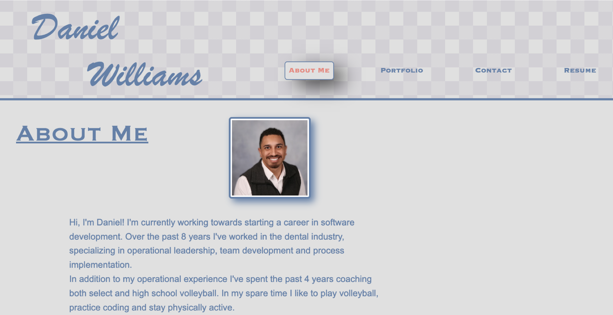

# Online Portfolio

## Description

This project is a personal online portfolio created to showcase my skills, projects, and professional achievements. I wanted to create a space where potential employers and collaborators can learn about my expertise and work in an engaging and visually appealing way. This project was built to highlight my abilities in web development, design, and problem-solving. It provides a centralized platform for sharing my resume, portfolio projects, and contact information with ease. Throughout this project, I expanded my knowledge of React, Bootstrap, responsive design, and deployment using Netlify.

## Table of Contents

- [Installation](#installation)
- [Usage](#usage)
- [Credits](#credits)
- [License](#license)

## Installation

To run this project locally, follow these steps:

1. Clone the repository:
    ```bash
    git clone "https://github.com/dcwilliams2/12-Challenge-Portfolio"
    ```
2. Navigate to the project directory:
    ```bash
    cd "12-Challenge-Portfolio"
    ```
3. Install the required dependencies:
    ```bash
    npm install
    ```
4. Build the application:
    ```bash
    npm run build
    ```
5. Start the development server:
    ```bash
    npm run start
    ```
6. Open your browser and go to `http://localhost:3000` to view the portfolio.

## Usage

This portfolio includes the following sections:

- **About Me**: A brief introduction and summary of my background.
- **Portfolio**: A gallery of my projects with previews and links.
- **Contact**: A form for reaching out to me.
- **Resume**: A downloadable version of my resume.

The portfolio is deployed and accessible [Here](https://portfolio-danielcwilliams.netlify.app).


### Screenshot



## Credits

- Collaborators: 
    - [Daniel Williams](https://github.com/dcwilliams2)
    - [ChatGPT](https://chatgpt.com)
- Tutorials and Resources:
    - React Documentation: [https://reactjs.org/docs](https://reactjs.org/docs)
    - Bootstrap: [https://getbootstrap.com](https://getbootstrap.com)
    - W3Schools: [https://www.w3schools.com/](https://www.w3schools.com/)
    - Coolors: [https://coolors.co/](https://coolors.co/)
    - CSSmatic Box Shadow Generator: [https://www.cssmatic.com/box-shadow](https://www.cssmatic.com/box-shadow)
    - FontAwesome: [https://fontawesome.com/](https://fontawesome.com/)
    - MagicPattern: [https://www.magicpattern.design/](https://www.magicpattern.design/)

## License

This project is licensed under the MIT License. For more details, see the [LICENSE](LICENSE) file or visit [https://choosealicense.com/licenses/mit/](https://choosealicense.com/licenses/mit/).

